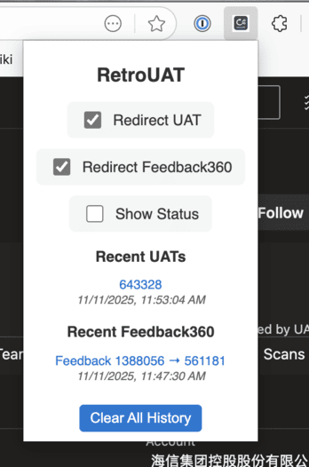

# RetroUAT

A Microsoft Edge browser extension that automatically redirects UAT Tracker and Feedback360 links to their corresponding Azure DevOps work items.



## Features

### 🔄 Automatic Redirects

- **UAT Tracker** - Automatically detects when you visit UAT Tracker links (`uatracker.microsoft.com`)
  - Seamlessly redirects to the matching Azure DevOps work item
  - Works with any UAT ID - just visit the tracker link and you're instantly redirected
- **Feedback360** - Automatically detects when you visit Feedback360 issue pages (`feedback360.microsoft.com`)
  - Waits for the page to load and extracts the ADO work item link
  - Redirects to the corresponding Azure DevOps Technical Feedback work item

### ⚙️ Easy Control

- **Toggle UAT Redirects** - Enable or disable UAT Tracker redirects independently
- **Toggle Feedback360 Redirects** - Enable or disable Feedback360 redirects independently
- **Keyboard Shortcut** - Quickly toggle both redirects using `Ctrl+Shift+U` (or `Cmd+Shift+U` on Mac)
- **Visual Status Badge** - Optional badge indicator on the extension icon shows when redirects are ON/OFF
  - Green "ON" badge when either redirect is enabled
  - Red "OFF" badge when both redirects are disabled
  - Can be hidden via the "Show Status" checkbox

### 📝 Recent History

- Tracks your last 5 redirected items for both UAT and Feedback360
- View timestamps for each redirect
- **UAT History** - Shows UAT IDs with direct links to work items
- **Feedback360 History** - Shows Feedback ID → Work Item ID mappings
- Click any ID in history to quickly open that work item
- Clear all history anytime with one click

## Installation

### Option 1: Install from GitHub Release (Recommended)

1. **Download the Extension**
   - Go to the [Releases page](https://github.com/cocallaw/retroUAT/releases)
   - Download the latest `retroUAT-extension.zip` file

2. **Unzip the File**
   - Extract the downloaded ZIP file to a folder on your computer
   - Remember this location - you'll need it for the next step

3. **Load in Microsoft Edge**
   - Open Microsoft Edge and navigate to `edge://extensions/`
   - Enable **Developer mode** (toggle in the left sidebar)
   - Click **Load unpacked**
   - Select the extracted `retroUAT` folder
   - The extension is now installed! 🎉

### Option 2: Install from Source

1. **Clone the Repository**

   ```bash
   git clone https://github.com/cocallaw/retroUAT.git
   cd retroUAT
   ```

2. **Load in Microsoft Edge**
   - Open Microsoft Edge and navigate to `edge://extensions/`
   - Enable **Developer mode** (toggle in the left sidebar)
   - Click **Load unpacked**
   - Select the `retroUAT` folder
   - The extension is now installed! 🎉

## Usage

### Basic Usage

**For UAT Tracker:**

1. Simply visit any UAT Tracker link (e.g., `https://uatracker.microsoft.com/?id=12345`)
2. The extension will automatically redirect you to the Azure DevOps work item
3. That's it! No configuration needed.

**For Feedback360:**

1. Visit any Feedback360 issue page (e.g., `https://feedback360.microsoft.com/issue?id=1388056`)
2. The extension will wait for the page to load, extract the ADO work item link, and redirect
3. You'll be taken directly to the Azure DevOps Technical Feedback work item

### Managing Settings

1. Click the RetroUAT extension icon in your Microsoft Edge toolbar
2. Use the checkboxes to:
   - **Enable UAT Redirects** - Turn UAT Tracker redirects on or off
   - **Enable Feedback360 Redirects** - Turn Feedback360 redirects on or off
   - **Show Status** - Display a badge on the extension icon showing current status

### Keyboard Shortcut

- Press `Ctrl+Shift+U` (Windows/Linux) or `Cmd+Shift+U` (Mac) to quickly toggle both redirects on/off

### Viewing History

- Click the extension icon to see your 5 most recent redirects for each type
- **Recent UATs** section shows UAT IDs with timestamps
- **Recent Feedback360** section shows Feedback ID → Work Item ID mappings
- Click any ID to open that work item in Azure DevOps
- Use "Clear All History" to reset both lists

## How It Works

### UAT Tracker

RetroUAT monitors your browsing for UAT Tracker URLs. When it detects a URL like:

```html
https://uatracker.microsoft.com/?id=12345
```

It automatically redirects you to:

```html
https://dev.azure.com/unifiedactiontracker/Unified%20Action%20Tracker/_workitems/edit/12345
```

### Feedback360

When you visit a Feedback360 issue page like:

```html
https://feedback360.microsoft.com/issue?id=1388056
```

The extension:

1. Waits for the page to fully load (with automatic retries)
2. Searches for the "ADO Id link" button on the page
3. Extracts the work item ID from the button's `name` attribute
4. Constructs and redirects to the Azure DevOps URL:

```html
https://dev.azure.com/unifiedactiontracker/Technical%20Feedback/_workitems/edit/{workItemId}
```

All processing happens locally in your browser - no external servers or data collection.

## Development

### Building from Source

The extension is built and packaged automatically using GitHub Actions whenever code is pushed to the main branch.

The workflow (`.github/workflows/build-extension.yml`):

1. Lints JavaScript files with ESLint
2. Validates the manifest.json
3. Packages the extension as a ZIP file
4. Uploads the artifact for download
5. Creates a GitHub Release when a tag is pushed

### Project Structure

```shell
retroUAT/
├── manifest.json       # Extension configuration
├── background.js       # Service worker for URL monitoring
├── popup.html          # Extension popup UI
├── popup.js           # Popup logic and interactions
├── popup.css          # Popup styling
├── icons/             # Extension icons
└── .github/workflows/ # CI/CD automation
```

## Permissions

RetroUAT requires the following permissions:

- **`storage`** - To save your preferences and redirect history locally
- **`tabs`** - To detect and redirect URLs
- **`scripting`** - To read page content for Feedback360 redirects
- **`host_permissions`** - Only for `uatracker.microsoft.com` and `feedback360.microsoft.com` to detect relevant URLs

Your data stays private and local to your browser.

## Contributing

Contributions are welcome! Feel free to:

- Report bugs or request features via [Issues](https://github.com/cocallaw/retroUAT/issues)
- Submit pull requests with improvements
- Share feedback on the extension

## Support

For questions or issues, please [open an issue](https://github.com/cocallaw/retroUAT/issues) on GitHub.
